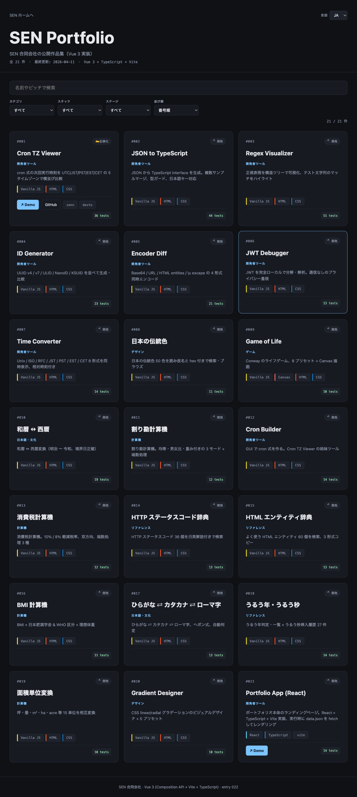

# portfolio-app-vue

[](https://sen.ltd/portfolio/portfolio-app-vue/)

SEN Portfolio ブラウザの **Vue 3 実装**。entry 021 (`portfolio-app-react`) と**完全に同じ仕様・同じデータ・同じ CSS** で実装し、フレームワーク同士を比較するためのシリーズ第 2 弾。

**Live demo**: https://sen.ltd/portfolio/portfolio-app-vue/



## 比較対象

| 実装 | エントリ | ディレクトリ |
|---|---|---|
| React 18 + TypeScript | 021 | `repos/portfolio-app-react/` |
| **Vue 3 + TypeScript** | **022** | **`repos/portfolio-app-vue/` (このリポジトリ)** |
| Svelte | 予定 | `repos/portfolio-app-svelte/` |
| Solid | 予定 | ... |

## 初期ベンチマーク (production build)

| 指標 | React 版 | **Vue 版** | 差 |
|---|---|---|---|
| main JS (uncompressed) | 151.01 kB | **73.65 kB** | **−51%** |
| main JS (gzip) | 48.84 kB | **28.76 kB** | **−41%** |
| CSS | 4.93 kB | 4.93 kB (同一) | 0 |
| 機能 | 完全一致 | 完全一致 | — |

Vue は同じ機能で **バンドルサイズ半分以下**。理由は Vue のランタイムが軽量であることに加え、リアクティブシステムがテンプレート内でそのまま動くので React のような仮想 DOM diff 用ランタイムが小さくて済むこと。

## 共通コード

以下の 4 ファイルは **React 版とバイト単位で同一**:

- `src/types.ts` — TypeScript の型定義
- `src/filter.ts` — 検索・フィルタ・ソートの純粋関数
- `src/data.ts` — データ fetch + runtime バリデーション
- `src/i18n.ts` — 日英メッセージ（framework 名の文字列だけ差分）
- `tests/filter.test.ts` — vitest 14 ケース

**フレームワーク固有なのはコンポーネント層だけ** (`App.vue`, `EntryCard.vue`, `main.ts`)。これがこのシリーズの狙いで、「スタックを変えると何が本当に変わるか」を浮き上がらせます。

## 特徴（React 版と同一）

- **検索**: 名前 / ピッチ / slug / タグ
- **フィルタ**: カテゴリ / スタック / ステージ
- **ソート**: 番号 / 新着 / 古い順 / 名前順
- **URL クエリ同期**
- **日本語 / 英語 UI**
- **ダーク UI**
- **レスポンシブ**（1/2/3 列）
- **runtime fetch** — `portfolio/data.json` をその場で読み込み

## ローカル起動

```sh
npm install
npm run dev
# → http://localhost:5173/portfolio/portfolio-app-vue/
```

## テスト

```sh
npm test
```

14 vitest テスト通過（filter/sort/search ロジック、フレームワーク非依存）。

## ライセンス

MIT. See [LICENSE](./LICENSE).

---

Part of the [SEN portfolio series](https://sen.ltd/portfolio/). Entry 022.
